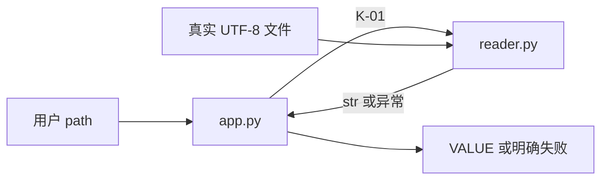

# 示例：从真实文件取得数值的 CLI（完整设计，非实测报告）

本例展示组件验证、真实边界、集成旅程的区别。正式项目按实际 grill 和环境替换。
文件可放 `docs/plan.md` 或用户指定的项目内路径；由 prepare-plan 自动绑定。

## 需求综合

用户通过 `python app.py <path>` 读取 UTF-8 文本，得到 `VALUE:<去除首尾空白后的值>`。
必需结果 O-01：通过交付 CLI 读回实际输入，不能返回固定示例。约束：不存在的文件
返回 exit 3/`input boundary unavailable`；空内容返回 exit 4/`empty input`。
只读、不持久化状态；不做 GUI、网络、后台服务和格式转换。

## 技术与可行性

选择 Python 标准库 pathlib/subprocess/tempfile，无额外依赖。依据：Python 官方
Path.read_text、subprocess.run 文档；实际 Python 命令与版本由规划者检查。
唯一目标边界是本机可读 UTF-8 文件，S-02 在 CLI 集成前验证实际 input.txt。
安装工具/可读文档不冒充边界实测；本文件是设计，尚无执行结论。

## 架构与数据约定

| 组件 | 文件 | 职责与接口 |
|---|---|---|
| C-01 reader | reader.py | K-01，读取/规范化/拒绝空内容，错误向上抛 |
| C-02 CLI | app.py | argv → K-01 → stdout/退出码，不另造读取逻辑 |

K-01 的权威签名/错误约定见执行索引。字符串不转换成数字；不吞权限/解码错误。
无共享可变状态。测试使用临时文件并清理，不写运行目录内的产品输入。




## 全部任务规格（唯一执行索引）

S-01 的组件检查不需要 app.py 或真实 input.txt；S-02 不提前要求完整 CLI；
S-03 才通过实际交付入口验证用户结果。后续步骤已经写明实现，不留给 build 设计。

```json engineering-plan
{
  "schema": "engineering-plan/2",
  "goal_id": "G-FILE-READER",
  "architecture": "Read-only reader owns decoding and empty validation; CLI owns argument/error presentation and delegates reading to K-01.",
  "data_flow": "argv path -> CLI -> reader -> UTF-8 file -> trimmed str or exception -> VALUE / nonzero exit",
  "shared_context": ["UTF-8; no mock fallback in production", "K-01 is the only reading implementation", "Read-only; test temporary files must be cleaned", "Missing input exit 3; empty input exit 4; other I/O errors are not success"],
  "decisions": [{"decision": "Use Python pathlib and standard-library tests", "reason": "Local read-only I/O needs no framework or service", "evidence": "Python docs: pathlib.Path.read_text and tempfile.TemporaryDirectory; actual interpreter path is bound for this host before execution"}],
  "components": [
    {"id": "C-01", "responsibility": "Read and normalize actual file content", "files": ["reader.py"], "interfaces": ["K-01"]},
    {"id": "C-02", "responsibility": "Public CLI and error presentation", "files": ["app.py"], "interfaces": ["main(argv: list[str]) -> int"]}
  ],
  "contracts": [{"id": "K-01", "owner": "C-01", "signature": "read_value(path: pathlib.Path) -> str", "definition": "Return UTF-8 text stripped of outer whitespace. Raise FileNotFoundError for missing input and ValueError('empty input') for empty/whitespace-only content; propagate other OSError/UnicodeError. No writes or process exits in reader."}],
  "boundaries": [{"id": "B-01", "kind": "filesystem", "external": true, "target": "Disposable input.txt on this host containing 42", "driver": "pathlib via delivered reader.py", "probe": {"command": "python -c \"from pathlib import Path; assert Path('input.txt').read_text(encoding='utf-8').strip() == '42'; print('INPUT_READY')\"", "assertion": {"type": "stdout-contains", "literal": "INPUT_READY"}}}],
  "journeys": [{
    "id": "J-01", "outcome_ids": ["O-01"], "boundary_ids": ["B-01"],
    "entry": "python app.py <path>", "preconditions": "Python available; input.txt contains 42; absent-input.txt does not exist",
    "actions": ["Run delivered app.py with the actual file", "Read stdout and exit status"],
    "expected": "VALUE:42 from actual file, not a fixture driver",
    "verification": {"command": "python app.py input.txt", "expected": "VALUE:42", "assertion_kind": "content", "empty_result_policy": "fail", "assertion": {"type": "stdout-contains", "literal": "VALUE:42"}},
    "negative_control": {"command": "python app.py absent-input.txt", "expected_exit_code": 3, "reason": "Same public entry must reject disconnected input", "assertion": {"type": "stdout-contains", "literal": "input boundary unavailable"}}
  }],
  "steps": [
    {
      "id": "S-01", "context": "Build the reading component and its shared contract; do not create the CLI yet",
      "depends_on": [], "component_ids": ["C-01"], "read_files": [], "files": ["reader.py", "tests/check_reader.py"],
      "consumes": [], "produces": ["K-01"],
      "implementation": ["Create read_value using Path.read_text(encoding='utf-8') and strip()", "Reject empty/whitespace value with ValueError; preserve other I/O errors", "Create tests/check_reader.py; insert Path(__file__).resolve().parents[1] into sys.path before importing reader because the check runs as a script", "Use TemporaryDirectory for non-ASCII content, missing input and empty input; assertions must execute before printing READER_OK; run before/after implementation"],
      "change": "from pathlib import Path\ndef read_value(path: Path) -> str:\n    value = path.read_text(encoding='utf-8').strip()\n    if not value: raise ValueError('empty input')\n    return value",
      "bounds": ["Unicode content preserved", "Missing/empty fail", "No persistent writes; temporary tests clean up"],
      "rollback": "Remove this step's reader and focused test",
      "failure_routes": {"implementation": "Fix decoding/empty logic without changing K-01", "environment": "If Python cannot start, repair interpreter setup before behavior testing", "design": "If input is not a local text file, return to planner with actual format evidence"},
      "preflight_boundary_ids": [],
      "checks": [{"id": "T-01", "level": "component", "boundary_ids": [], "command": "python tests/check_reader.py", "assertion": {"type": "stdout-contains", "literal": "READER_OK"}}],
      "journey_ids": []
    },
    {
      "id": "S-02", "context": "Verify the delivered reader against the actual target file before expanding CLI integration",
      "depends_on": ["S-01"], "component_ids": ["C-01"], "read_files": ["reader.py"], "files": ["reader.py"],
      "consumes": ["K-01"], "produces": [],
      "implementation": ["Check that the real disposable input exists through preflight", "Invoke delivered read_value on input.txt", "Compare actual content with 42; change code only for a proven reader defect"],
      "change": "from pathlib import Path\nfrom reader import read_value\nassert read_value(Path('input.txt')) == '42'\n# Verification task: no speculative product changes",
      "bounds": ["Absent real file blocks; do not substitute fixture data", "Read-only"],
      "rollback": "No writes expected; revert only a proven correction introduced here",
      "failure_routes": {"implementation": "Repair actual reader defect then repeat component and boundary checks", "environment": "Restore input.txt or correct authorization; do not manufacture PASS", "design": "Unexpected filesystem/encoding constraint returns to plan"},
      "preflight_boundary_ids": ["B-01"],
      "checks": [{"id": "T-01", "level": "boundary", "boundary_ids": ["B-01"], "command": "python -c \"from pathlib import Path; from reader import read_value; assert read_value(Path('input.txt')) == '42'; print('BOUNDARY_OK')\"", "assertion": {"type": "stdout-contains", "literal": "BOUNDARY_OK"}}],
      "journey_ids": []
    },
    {
      "id": "S-03", "context": "Connect the public CLI to K-01 and deliver O-01; verify actual readback, missing and empty input",
      "depends_on": ["S-02"], "component_ids": ["C-02"], "read_files": ["reader.py"], "files": ["app.py", "tests/check_cli.py"],
      "consumes": ["K-01"], "produces": [],
      "implementation": ["Create main(argv) requiring exactly one path; usage errors exit 2", "Import K-01 rather than duplicate reading logic", "Render VALUE:<result>; map FileNotFoundError to exit 3 and ValueError to exit 4", "Create tests/check_cli.py: resolve app.py from Path(__file__).resolve().parents[1]; run [sys.executable, app_path, input_path] with subprocess capture_output/text and bounded timeout", "Generate two independent input values inside TemporaryDirectory and assert exact VALUE:<input>; also assert exit 4 on empty, exit 3 on missing; print CLI_CASES_OK only after all assertions"],
      "change": "from reader import read_value\n# main: check len(argv)==1; call read_value(Path(argv[0])); print VALUE; return 0\n# FileNotFoundError: print input boundary unavailable, return 3\n# ValueError: print empty input, return 4\n# __main__: raise SystemExit(main(sys.argv[1:]))",
      "bounds": ["No argument/multiple arguments exit 2", "Empty exit 4", "Arbitrary file values must be read, not hardcoded", "All temp inputs cleaned"],
      "rollback": "Remove CLI and its tests while retaining validated reader",
      "failure_routes": {"implementation": "Fix CLI wiring/error mapping, keep K-01 unchanged", "environment": "If target disappears, restore it and repeat boundary verification", "design": "If required UI/entry differs from CLI, stop and return to planner"},
      "preflight_boundary_ids": [],
      "checks": [{"id": "T-01", "level": "component", "boundary_ids": [], "command": "python tests/check_cli.py", "assertion": {"type": "stdout-contains", "literal": "CLI_CASES_OK"}}],
      "journey_ids": ["J-01"]
    }
  ]
}
```

## 走查与需求追踪

- O-01 → C-01/K-01 + C-02 → S-01/02/03 → J-01。调用不存在断边：app 导入 reader。
- 正常：argv 的 path 经 K-01 到文件，再回到 CLI。失败：FileNotFoundError 经
  同一合同返回，CLI 显示错误并退出 3；不是另一个程序输出预期失败。
- S-01 可在没有 app.py/input.txt 时验证；S-03 消费 K-01，依赖生产与边界验证。
- 单个固定输入不能排除硬编码，因此 S-03 还运行生成内容的真实子进程检查。
- 待实测：Python 路径和真实 input.txt；对应 S-02 的探针。任何检查都未在本计划
  编写时宣称通过。外部可行性失败按 failure_routes 反馈，不继续扩张。
